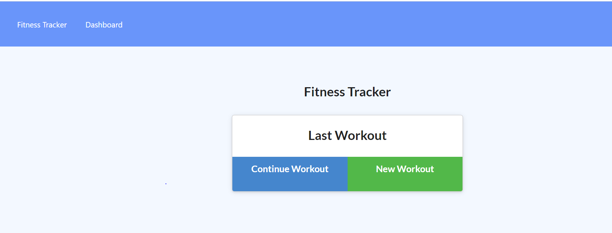

# Workout Tracker

[LIVE DEMO](https://fitness-tracker-aida.herokuapp.com/)

[GitHub Repo](https://github.com/aod1411/Workout-Tracker)

## Description
This application serves as an online fitness tracker. The user is able to update the database with either a resistance or cardio workout. This app is an easy to use, intuitive way of documenting information related to the user's fitness goals. As usual, I learned the importance of deploying early to Heroku. 



## Table of Contents 

1. [Installation](#installation)
2. [Usage](#usage)
3. [License](#license)
4. [Questions](#questions)

## Installation

```
npm install
npm run seed
npm start
```

## Usage 

This app displays your last workout along with cumulative statistics of previous workouts saved to a Mongo database. Users can also add a new workout and check out the results on the dashboard, a summary page that displays the user's progress over time. 

## License

The license for this application is MIT.


## Questions

If you have any questions about the repository, open an issue or contact me directly at nothingbutgoodthoughts@comcast.net
You can find more of my work at [aod1411](https://github.com/aod1411)
